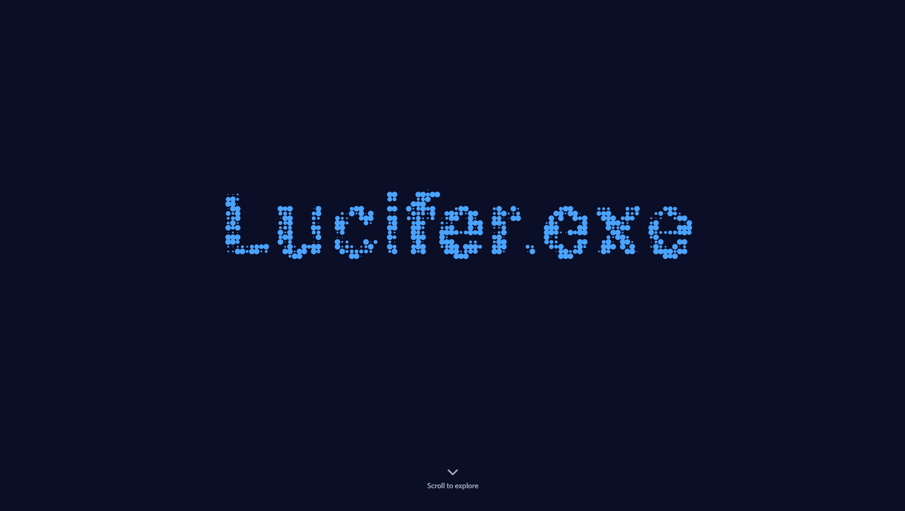

<div align="center">

# ✨ LUCID PARTICLES

*Interactive particle animation meets Discord profile cards*

[](http://creativecommons.org/licenses/by-nc-sa/4.0/)


### 🎮 [**LIVE DEMO**](https://luciefairepy.github.io/lucid-particles-demo) 🎮

**Experience it now:** [luciefairepy.github.io/lucid-particles-demo](https://luciefairepy.github.io/lucid-particles-demo)



---

</div>

---

## 🌟 Overview

An interactive particle animation demo featuring authentic Discord profile card integration. Built with vanilla JavaScript and HTML5 Canvas, this project showcases dynamic particle text rendering that responds to user interaction, combined with Sybrax's pixel-perfect Discord card design.

### ✨ Features

- 🎨 **Interactive Particle Animation** - Text particles that react to mouse/touch
- 🎮 **Authentic Discord Card** - Real Sybrax Discord profile with animated GIF banner
- ⚙️ **Fully Configurable** - One-file configuration system (`config.js`)
- 📱 **100% Responsive** - Optimized for mobile, tablet, and desktop
- 🚀 **Zero Dependencies** - Pure vanilla JavaScript, no build process
- 🎭 **Custom Badges & Roles** - Discord-style badges and role system
- ⚡ **60 FPS Performance** - Smooth canvas rendering
- 🌈 **Customizable Colors** - Easy particle color theming

---

## 🎯 Quick Start

### Prerequisites

**None!** Just a web browser. No Node.js, no npm, no build tools required.

### Installation

1. **Clone the repository**
```bash
git clone https://github.com/LucieFairePy/lucid-particles-demo.git
cd lucid-particles-demo
```

2. **Open in browser**
```bash
# Option 1: Double-click index.html

# Option 2: Use a local server (recommended)
python -m http.server 8000
# or
npx serve .
```

3. **Visit** `http://localhost:8000`

That's it! 🎉

---

## ⚙️ Configuration

All customization is done through `config.js`. No code editing required!

### 🎨 Particle Text
```javascript
text: {
  content: 'YOUR NAME',  // Text displayed as particles
  fontWeight: 'bold',
  fontFamily: 'sans-serif'
}
```

### 🌈 Particle Colors
```javascript
particle: {
  colors: ['#4aa3ff', '#6eb5ff', '#3d8fd1'],  // Add as many colors as you want
  minSize: 1,
  maxSize: 6,
  dpi: 200  // Higher = less particles (better performance)
}
```

### 👤 Discord Profile
```javascript
personal: {
  name: 'Your Name',
  username: 'your_discord',
  avatar: 'https://cdn.discordapp.com/avatars/YOUR_ID/HASH.webp',
  banner: './assets/img/banner.gif',  // Use custom GIF or image
  bio: 'Your bio here...',
  memberSince: 'Jun 14, 2020'
}
```

### 🏅 Discord Badges

Available badges in `/assets/img/badges/`:
```javascript
badges: [
  'bravery',    // HypeSquad Bravery
  'nitro',      // Discord Nitro
  'boost'       // Server Boosting
]
```

**Custom badges:**
```javascript
badges: [
  { type: 'custom', image: './path/to/badge.png', tooltip: 'My Badge' }
]
```

### 🎭 Discord Roles
```javascript
roles: [
  { name: '👑 Owner', color: '#f04747' },
  { name: '💻 Developer', color: '#5865F2' },
  { name: '🎮 Gamer', color: '#43b581' }
]
```

**Common Discord colors:**
- `#5865F2` - Blurple
- `#57F287` - Green  
- `#FEE75C` - Yellow
- `#EB459E` - Pink
- `#ED4245` - Red

---

## 📁 Project Structure
```
lucid-particles-demo/
├── index.html          # Main HTML file
├── config.js           # ⚙️ EDIT THIS FILE to customize
├── style.css           # Custom styles
├── script.js           # Particle animation engine
├── script-add.js       # Scroll fade effects
├── assets/
│   ├── css/
│   │   └── style.css   # Sybrax Discord card styles
│   ├── font/           # Whitney font (Discord official)
│   └── img/
│       ├── banner.gif  # Animated banner
│       ├── logo_blue.png
│       └── badges/     # Discord badge icons
└── README.md
```

---

## 🎨 Customization Examples

### Change Particle Text
```javascript
text: { content: 'AWESOME' }
```

### Use Custom Colors
```javascript
particle: {
  colors: ['#ff6b6b', '#4ecdc4', '#45b7d1']  // Red, teal, blue
}
```

### Add Your Discord Avatar

1. Get your Discord User ID
2. Right-click your profile picture → "Copy Image Address"
3. Paste into `config.js`:
```javascript
avatar: 'https://cdn.discordapp.com/avatars/YOUR_ID/HASH.webp?size=128'
```

### Change Banner

Replace `banner.gif` in `/assets/img/` or use URL:
```javascript
banner: 'https://i.imgur.com/your-banner.gif'
```

---

## 🎯 Performance Tips

1. **Reduce particles** - Increase `dpi` value (200-300)
2. **Disable mouse interaction** - Set `mouseRepulsion.enabled: false`
3. **Use fewer colors** - 2-3 colors max
4. **Shorter text** - Less characters = better performance

---

## 🛠️ Built With

- **Vanilla JavaScript** - No frameworks
- **HTML5 Canvas** - Particle rendering
- **CSS3** - Animations & layouts
- **[Sybrax Discord Card](https://github.com/Sybrax/Discord-User-Card)** - Discord UI components
- **Whitney Font** - Discord's official typeface

---

## 📜 License

This project is licensed under the **GNU General Public License v3.0**.

[](https://www.gnu.org/licenses/gpl-3.0)

### What this means:

**You CAN:**
- ✅ Use this code for personal projects
- ✅ Modify and adapt the code
- ✅ Use commercially **IF** you share your source code

**You MUST:**
- 📝 Give credit to Lucifer.exe
- 🔓 Share your source code if you distribute
- 📄 Keep the same GPL v3 license

**You CANNOT:**
- 🚫 Make proprietary/closed-source versions
- 🚫 Remove copyright notices

This ensures the code stays free and open for everyone! 🎉

See [LICENSE](./LICENSE) for full legal text.

---

### 🙏 Additional Credits

- **Particle Engine** - Created by [Lucifer.exe](https://github.com/LucieFairePy)
- **Discord Card** - Based on [Sybrax's Discord-User-Card](https://github.com/Sybrax/Discord-User-Card)
- **Icons** - [Font Awesome](https://fontawesome.com)

---

## 🤝 Contributing

Contributions are welcome! Please:

1. Fork the repository
2. Create a feature branch (`git checkout -b feature/amazing`)
3. Commit your changes (`git commit -m 'Add amazing feature'`)
4. Push to the branch (`git push origin feature/amazing`)
5. Open a Pull Request

---

## 📞 Support

- 🐛 [Report a Bug](https://github.com/LucieFairePy/lucid-particles-demo/issues)
- 💡 [Request a Feature](https://github.com/LucieFairePy/lucid-particles-demo/issues)
- ⭐ [Star this repo](https://github.com/LucieFairePy/lucid-particles-demo) if you like it!

---

## 👤 Author

**Lucifer.exe**
- GitHub: [@LucieFairePy](https://github.com/LucieFairePy)
- Discord: Lucifer.py

---

<div align="center">

**Made with ❤️ and JavaScript**

⭐ Star this repo if you found it helpful!

</div>
